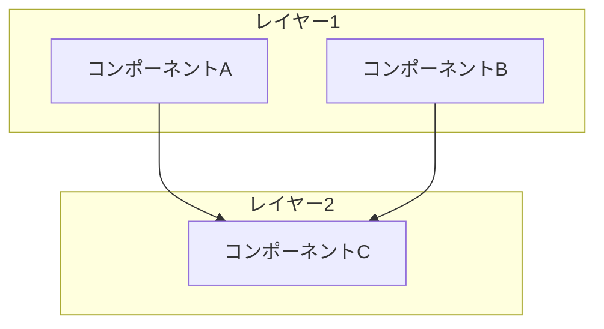
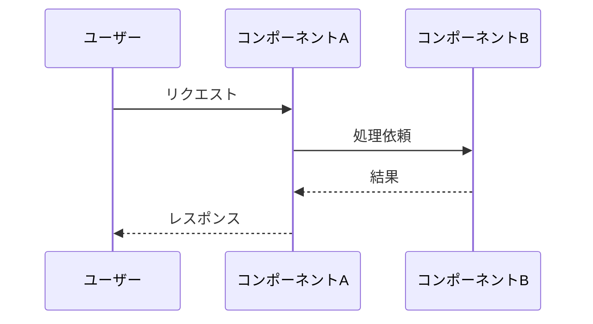

# アーキテクチャ解説型テンプレート

システム構成や設計思想を図解して解説する記事向け。全体像からコンポーネント詳細まで段階的に深掘りする構成。

---

## 構成

```
# はじめに
  - システムの背景と目的
  - 一言要約（引用ブロック）
  - 本記事の対象読者
  - 参考情報（:::message alert で日付免責 + リンク一覧）
---

# 全体アーキテクチャ

Mermaid 図で全体構成を示す。



  - 図の補足説明（2〜3文）
  - 主要コンポーネントの役割一覧（表）

| コンポーネント | 役割 | 使用技術 |
|--------------|------|---------|
| A | ... | ... |
| B | ... | ... |

---

# コンポーネント詳細
  ## 🏗️ コンポーネントA
    - 役割と責務
    - 内部構成（必要に応じてサブ図）
    - 主要な設定/パラメータ（表）
    - コード例（該当する場合）

  ## 🏗️ コンポーネントB
    - 同上の構成

---

# データフロー



  - フローの各ステップの説明
  - エラーケースやタイムアウトの扱い

---

# 設計判断のポイント
  ## なぜ〇〇を選んだか
    - 検討した選択肢
    - 選定理由（表形式で比較すると分かりやすい）

  ## トレードオフ
    - この構成のメリット/デメリット

---

# まとめ
  - アーキテクチャの要点を振り返る
  - 今後の改善点や拡張の方向性

# 参考リンク
  - アーキテクチャ決定に影響した資料
  - 使用技術の公式ドキュメント
```

## ポイント

- Mermaid 図が記事の核。全体図 → コンポーネント図 → データフロー図と段階的に詳細化
- `subgraph` でレイヤーや境界（クラウド/オンプレ等）を表現
- 設計判断の「なぜ」を明記すると記事の価値が高まる
- コンポーネントの見出しに絵文字を使い、視認性を確保
