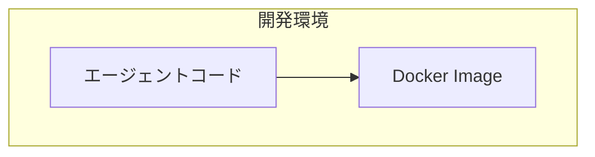

# スタイルガイド

著者の既存記事から抽出した文体・フォーマットルール。記事執筆時に必ず参照する。

---

## 文体

- **敬体**（です・ます調）を基本とする
- 技術的に正確でありながら、親しみやすいトーン
- 断定と疑問を織り交ぜて読者を引き込む（例: 「そもそも、これを使う対象者はどういう方で、どういうシーンで使うのでしょう？」）
- 太字（`**`）で重要なキーワードを強調
- 「！」を適度に使い、発見や驚きを表現

## 見出し

- `#` はセクション大見出し（例: `# はじめに`）
- `##` / `###` でサブセクション
- 機能一覧系では見出しに絵文字を使用（例: `### 🧠 モデル`、`### 🔧 ツール`）
- 水平線 `---` でセクション間を区切る

## データ整理

- **表（Markdownテーブル）を積極活用** — 比較、一覧、機能紹介は表で整理
- 表のヘッダーは太字にしない（Markdown標準で太字表示される）
- 列数は2〜4列が読みやすい

例:
```markdown
| 観点 | プロンプトベース | Hosted Agent |
|------|----------------|--------------|
| 構築方法 | GUIでプロンプト設定 | コードでロジック実装 |
```

## コードブロック

- 言語指定を必ず付ける（```python, ```bash, ```json, ```yaml, ```mermaid 等）
- セットアップコマンドは `bash` で表記
- 設定ファイルは適切な言語（json, yaml 等）で表記
- コード内コメントは日本語で

## 図解（Mermaid）

- アーキテクチャ図: `graph TB` または `graph LR`
- フロー図: `sequenceDiagram`
- `subgraph` でグルーピング
- ノードのラベルは日本語OK（`<br/>` で改行）

例:


## 画像

- 形式: ``
- スクリーンショットは手順の直後に配置
- alt テキストは省略可（Zennでは表示されない）

## 注釈（Zenn独自記法）

- 注意事項: `:::message alert` 〜 `:::`
- 補足情報: `:::message` 〜 `:::`
- 日付免責: 「本記事の内容は **YYYY年M月D日時点** の情報に基づいています。」を冒頭に配置

例:
```markdown
::: message alert
本記事の内容は **2026年2月1日時点** の情報に基づいています。
:::
```

## 参考リンク

- 記事冒頭の `### 参考情報` セクション、または記事末尾に配置
- 公式ドキュメント、GitHub リポジトリ、関連記事へのリンク
- リンクテキストはタイトルそのまま（英語のままでOK）

## 記事の導入パターン

1. **背景の提示**: 技術トレンドや前回記事の振り返りから入る
2. **一言要約**: 引用ブロック（`>`）でサービス/技術を一言で説明
3. **本記事の目的**: 何を構築/解説するかを明示
4. **対象読者**: 表形式で「対象者 × シーン」を整理（必要に応じて）

## 記事の締め方

1. **まとめ**: 本記事で行ったことを端的に振り返る
2. **次のステップ**: 発展的な内容や関連技術への言及
3. **参考リンク**: 公式ドキュメント等へのリンク一覧
